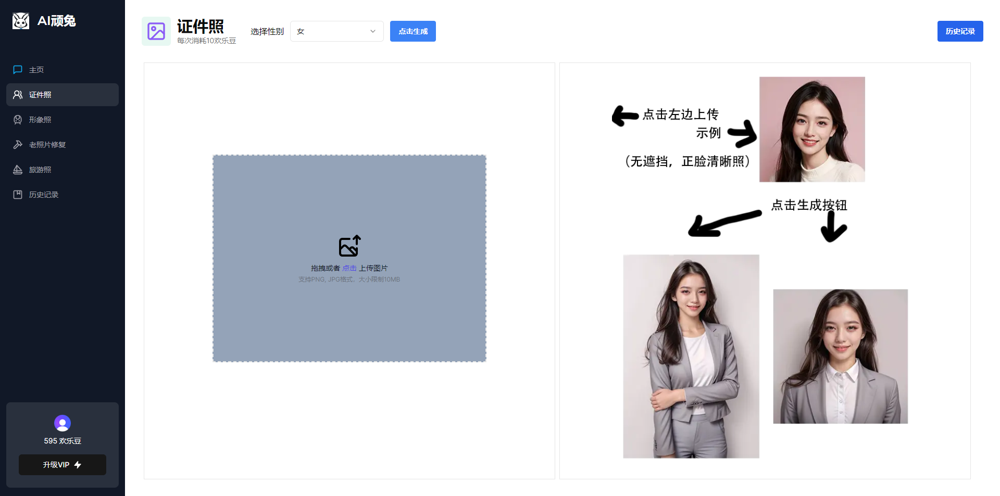
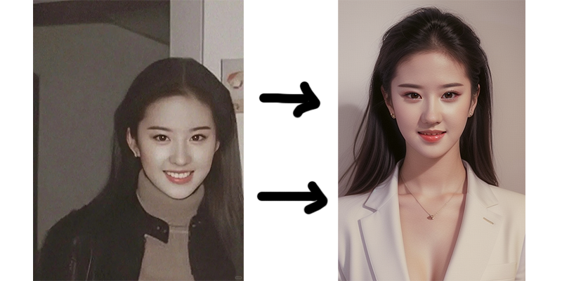
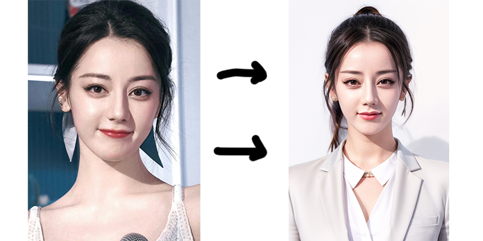
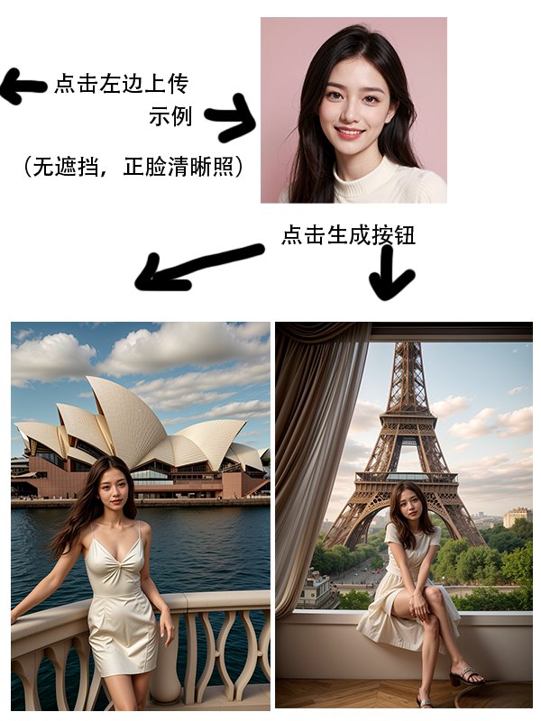

基于 nextjs 14，comfyui 的AI证件照生成项目，额外附带有老照片修复，个人形象照，旅游照。

个人练手项目，欢迎随意把玩。

## overview







## Getting Started

setup your comfyui

setup your mysql database

create .env file, you can ref to env_example

```bash
npm i
npx prisma db push
npm run dev
```

Open [http://localhost:3000](http://localhost:3000) with your browser to see the result.

如果你觉得本项目有用, you can buy me a coffee.

